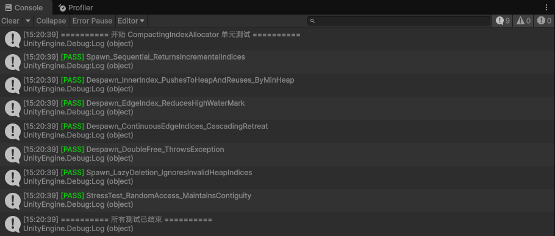

# CompactingIndexAllocator

`CompactingIndexAllocator` 是一个专为 Unity DOTS 设计的**高性能、紧凑型物理索引分配器**。它并非传统的对象池，而是通过算法维持整数索引的最密排布，使活跃数据在物理内存中如受重力般“沉降”在最低地址，从而最大化 CPU Cache Line 命中率。

## ✨ 核心机制

* **重力沉降 (Min-Heap Allocation)**
  永远优先复用数值最小的空闲索引，确保内存前段被 100% 填满。
* **自动回收机制(Automatic-Recycling-Mechanism)**
  当边缘索引被销毁时，系统会向前嗅探，收复尾部所有内存空洞。
* **安全防护机制**
  内置 `NativeBitArray` 作为唯一状态表，以极低开销拦截双重释放 (Double Free) 导致的数据混乱。
* **惰性清理 (Lazy Deletion)**
  在执行 `Spawn` 弹出时自动弹出无效而索引进行丢弃,复杂度 O(1) ，有效消除碎片整理开销。

## ⚠️ 注意事项

**严禁并发调用**：
禁止在`IJobParallelFor` 或其他并行逻辑下执行 `Spawn()` 和 `Despawn()` 函数，将会导致严重的破坏堆结构与引发缓存一致性问题。

**正确使用姿势**：
只需要在 Job 或者并行逻辑中仅记录需要销毁的索引（如存入无锁队列），随后在主线程的**同步点 (Sync Point)** 集中、串行地调用系统的相关功能即可。
##  测试用例
项目内已经写入测试用例。
本地测试结果如下：
